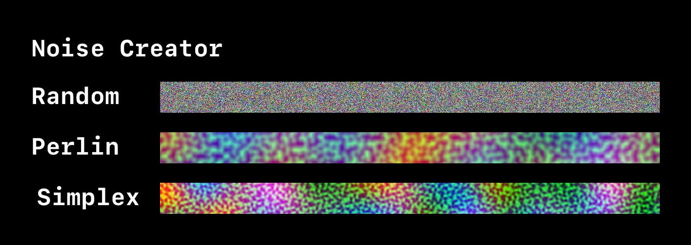
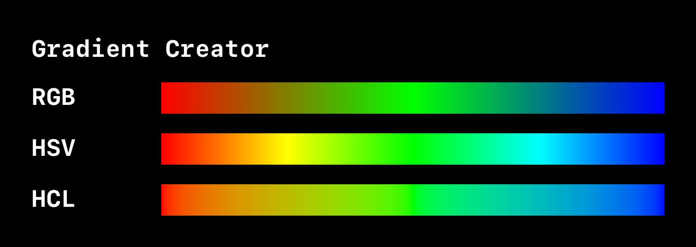

# TextureTools
Texture creation editor tools for Unity

**RECOMMENDED INSTALLATION**
- Add via the Unity Package Manager
- "Add package from git URL..."
- `https://github.com/ryanslikesocool/TextureTools.git`
- Add

**Not-so Recommended Installation**
- Get the latest [release](https://github.com/ryanslikesocool/TextureTools/releases)
- Open with the desired Unity project
- Import into Plugins

## Why?
It's 2021.  Computer graphics have been around for a few decades now and I still haven't seen anything that generates *good* gradients.  Most graphics applications (Photoshop, Sketch, etc) think they know what I want and compress certin textures on export, so there tends to be artifacts.  No compression here!

## Usage
Use to create high-quality textures for use in projects.
Texture assets can be found in the menu bar under `Assets/Create/Developed With Love/TextureTools`

## Noise Tool (`Assets/Create/Developed With Love/TextureTools/Noise Texture`)
The Noise Tool can generate 2D and 3D noise textures with multiple configurable options.\

- Dimensionality: is the result texture 2D or 3D?
    - 2D: Classic, timeless, flat.  Good for general use.  Will export as a normal image based on the Dynamic Range setting.
    - 3D: Extra dimension of color (wow!).  Good for use in vector fields.  Will export as `.asset` and can only be used in Unity.
- Channels: how many channels should the result texture use?  (G and B channels will default to 0.  Alpha channel will default to 1)
- Dynamic Range: what dynamic range should the result texture use?
    - LDR: Low Dynamic Range.  Less colors and more likely to be web-safe.  2D textures will export as `.png`
    - HDR: High Dynamic Range.  More colors and generally looks better.  2D textures will export as `.exr`
- Size: how large should the texture be (in pixels)?
- Random: what method should be used when generating colors?  Generation conforms to the Channels setting.  Unused channels will not be calculated
    - Random: assigns a pseudo random value for each channel of each pixel.
    - Perlin: use the perlin noise method for each channel based on UV coordinates.  Uses Scale and Offset settings.
    - Simplex: use the simplex noise method for each channel based on UV coordinates.  Uses Scale and Offset settings.
- Scale: how much should the UV coordinates be scaled?  Uniform for each channel (X -> R, Y -> G, Z -> B, W -> A).
- Offset: how far should the UV coordinates be offset?  Uniform for each channel (X -> R, Y -> G, Z -> B, W -> A).

## Gradient Tool (`Assets/Create/Developed With Love/TextureTools/Gradient Texture`)
The Gradient Tool can generate 2D gradients with an indefinite amount of anchors, either horizontally or vertically\

- Direction: should the gradient be rendered horizontally or vertically?  Normally best to use the longer axis of the texture size
- Dynamic Range: what dynamic range should the result texture use?
    - LDR: Low Dynamic Range.  Less colors and more likely to be web-safe.  Textures will export as `.png`
    - HDR: High Dynamic Range.  More colors and generally looks better.  Textures will export as `.exr`
- Color Definition: how should the gradient be rendered?
    - RGB: classic, "lazy" interpolation.  Direct interpolation between values.  The same as using `Color.Lerp`.
    - HSV: convert colors to HSV color space, interpolate (mainly based on hue), then convert back to RGB.  Looks much better than RGB, but is a more expensive to render
    - HCL: convert colors to HCL color space, interpolate, then convert back to RGB.  Looks similar to HSV, but works closer to how the human eye percieves brightness.  The most expensive to render.
- Texture Size: how large should the result texture be? (in pixels)
- Anchors: an indefinite amount of anchors used to create the gradient.
    - Time: where should the anchor be located on the gradient? [0 - 1]
    - Color: what color should the anchor be?